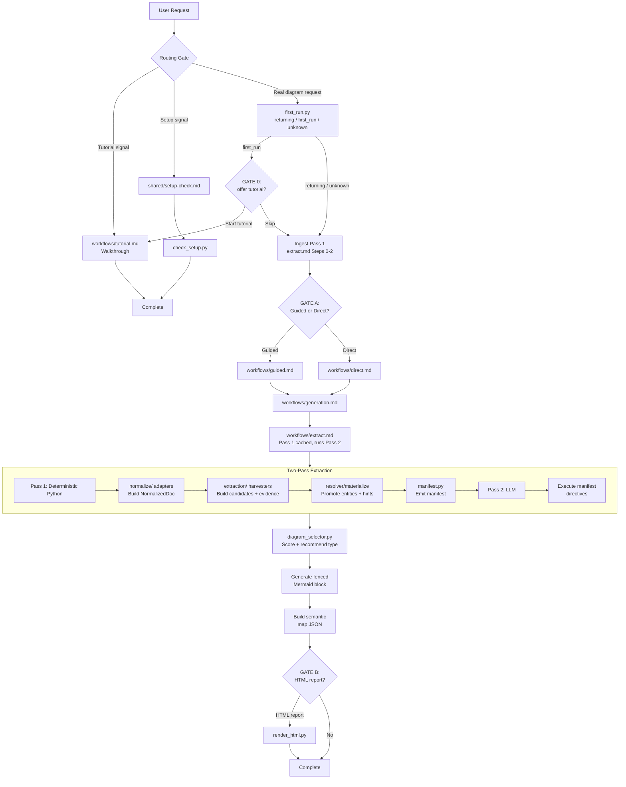

# legal-diagram

Generate legal Mermaid diagrams from any input, with an optional downloadable HTML figure.

## Part A: User Guide

Everything needed to set up and use the skill: what it does, setup, a quick start, the first-run tutorial offer, the interaction gates, the two build lanes, HTML export, and troubleshooting.

### What It Does

`/legal-diagram` turns legal material into a diagram. Drop a contract, paste a matter description, or just describe a dispute, and it produces a timeline, an org chart, an obligation checklist, a decision tree, or one of several other diagram shapes. A Python engine reads the structure of your document, harvests legal candidates with evidence, promotes high-confidence entities, and hands compact unresolved evidence to the assistant; the assistant then fills the gaps and picks the diagram that fits. The diagram renders inline in any Mermaid-capable Markdown viewer (GitHub, VS Code, Obsidian, the Claude web app), and can be exported as an HTML figure with a plain-language walkthrough.

### Prerequisites

- Python 3.9 or newer on your PATH.
- For binary formats (`.docx`, `.pdf`, `.xlsx`, `.pptx`) and HTML export: the packages in `requirements.txt`. Use `constraints.txt` for release-verification installs. Markdown, plain text, pasted text, and conversation context need only the Python standard library, so you can use the skill before installing anything.
- No special environment is required. HTML export defaults to a `./diagrams/` folder (created if absent), or any path you specify. No note file is written.
- Semantic node colouring is pure JS/CSS in the HTML export — no new Python dependencies.

### Installation / Setup

1. Confirm Python: `python --version` (expect 3.9+).
2. Install the optional parsers and HTML renderer:
   ```bash
   pip install -r requirements.txt -c constraints.txt
   ```
3. Verify setup:
   ```bash
   python scripts/check_setup.py
   ```
   You should see JSON like `{"ok": true, "installed": [...], "missing": [], "optional": {...}}`. If `ok` is `false`, the `missing` list names the required packages to install. The `optional` key reports optional packages: `pdfplumber` (PDF table extraction) is listed there; its absence does not set `ok` to `false` and does not block any other format. The `mermaid_vendor` key reports whether the offline Mermaid engine is vendored at `assets/vendor/mermaid.min.js`; when it is absent the key carries a hint to run `python scripts/fetch_mermaid.py`, and HTML export falls back to the source-only panel or `--allow-cdn`. Even with packages missing, Markdown and pasted-text input still work.

Inside the assistant, you can also just say "check setup" to run this step.

### Quick Start

Drop a contract and ask for a picture. Each choice below is a selectable pop-up, not something you type:

> You: Diagram this dispute. [attach `vendor-dispute.md`]
>
> Skill (first run only): First time here. Want a quick tutorial, or go straight to your diagram?  `[Start tutorial]`  `[Skip, straight to my diagram]`
>
> You: `[Skip, straight to my diagram]`
>
> Skill: I've read **vendor-dispute.md**. Found 2 parties, 6 events, 3 obligations. How should I build it?  `[Guided, step by step]`  `[Direct, just make it]`
>
> You: `[Direct, just make it]`
>
> Skill: I drew a **timeline** because six dated events drive a litigation chronology. This matter would also work as an **obligation checklist** or a **party map**. Want either?
> [fenced Mermaid timeline displayed inline, nodes coloured by semantic category, no note written]
>
> Skill: Want the full report as a file you can open, print, and share?  `[HTML report]`  `[No, just the diagram]`

That is the whole loop: a one-time tutorial offer, ingest and show what was found, choose how to build, draw the best diagram, explain why, then offer the HTML report. Returning users skip the tutorial offer automatically.

### Detailed Usage / Deep Dives

Right after it ingests your material, the skill resolves build mode: guided or direct. This is a mandatory choice. Only typing the literal `--direct` or `--guided` flag answers it in advance and skips the pop-up; the flag is your own recorded choice. Otherwise the build-mode pop-up always shows and waits for you, no matter how detailed or specific your request was. The skill never guesses the mode from your wording. A separate first-run check offers the tutorial unless the skill can confirm you have run it before.

#### Guided lane (default)

The interactive path, best for casual users. It digests your input (or, with no document, asks a short set of questions tailored to the matter type: litigation, corporate, compliance, employment, IP, privacy, bankruptcy, tax, real estate), then walks you through two blocking gates before generating:

1. **Plain-language digest** — every populated field rendered in plain English (parties, events, obligations, claims, communications, risk items, legal authorities, and so on). You confirm, correct names, add missing items, or remove anything before proceeding.
2. **Type confirmation** — the selector recommends a diagram type with a rationale and lists alternatives; you confirm or switch before anything is drawn.

After generation, the skill offers the HTML report as a pop-up choice. One matter commonly yields several diagrams in a session. The build-mode pop-up always shows both options in a fixed order and waits for your pick; it never pre-selects one based on your wording.

The HTML export includes a semantic colour layer: nodes are coloured by legal meaning using a muted legal palette (party nodes in slate blue, authority in sage, risk in dusty rose, outcomes in stone grey). Accessibility patterns (diagonal hatch for authority, cross-hatch for risk, dots for outcomes) provide a colorblind-safe secondary channel. A high-contrast toggle button (`◐`) in the diagram controls switches all fills to white with black borders and bold strokes. A colour legend is auto-generated below the diagram from the active palette.

#### Direct lane (power user)

The fast path. Entered when you pass the literal `--direct` flag (your recorded answer, skips the pop-up), or when you pick **Direct, just make it** at the build-mode pop-up. It reads every signal in one pass and generates with at most one interruption: it stops only if extraction is empty or the diagram-type confidence falls below 0.50. The missing-file and no-input cases are handled before this lane runs. The HTML report is a separate pop-up after the diagram.

#### Tutorial lane (first run)

A guided walkthrough that detects your setup and runs one worked example end to end (a litigation chronology or a corporate ownership structure). It is offered through a pop-up you can decline. A small state file (`~/.legal-diagram/state.json`, or wherever `$LEGAL_DIAGRAM_STATE` points) records that the offer was made, so once the skill can confirm you are a returning user it stops offering. The offer is suppressed only on that confirmed-returning signal; where no writable disk exists, such as some web sandboxes, the state cannot be confirmed, so the skill offers the tutorial rather than deciding for you. You can also start it anytime with "tutorial", "show me how", "first time", or "demo".

#### Input formats

Markdown, plain text, `.docx`, `.pdf`, `.xlsx`, `.pptx`, pasted text, or the current conversation. Large PDFs are probed first and you are asked for a page range; scanned PDFs (no extractable text) prompt you to paste instead.

The extractor emits only the input basename in `input_source` by default. Full local paths are available only with `--include-source-path` for trusted internal workflows. Default resource caps protect public/shared use: 25 MB file size, 50 PDF pages, 5000 DOCX paragraphs, 200 DOCX tables, 5000 DOCX table rows, 200 PPTX slides, 5000 PPTX text shapes, 20 XLSX sheets, 1000 XLSX rows per sheet, and 50000 XLSX cells per sheet. Override these with the matching `--max-*` flags only for trusted local inputs.

#### Diagram names

You only ever see plain-language names: timeline, schedule, flowchart, decision tree, org chart, obligation checklist, who-does-what-when, mind map, priority grid, experience map. You can ask for any of these by name ("make me an org chart") and the skill maps it internally.

#### HTML export

After every diagram, the skill offers the HTML report as a pop-up choice, **HTML report** or **No, just the diagram**. Choosing the report generates an HTML figure: the diagram plus a scientific-paper-style caption, an overview, a "how to read this" legend, key observations, and limitations. The W5 UX surface provides:

- **Overview tab open by default.** The first tab (Overview) is active in the served markup, not applied by JavaScript, so content is immediately visible.
- **Source-only explainer panel.** When the Mermaid rendering engine is absent (no vendored file, no CDN), the diagram area shows a plain-language explainer panel rather than raw diagram instructions. The panel explains the situation, provides a collapsed disclosure with the diagram source, and suggests asking the sender for the rendered version.
- **Advanced editor disclosure.** An "Advanced: edit the diagram's drawing instructions" `<details>` element lets users tweak the Mermaid source and hit Re-draw; Cancel restores the original. Changes affect the picture only, not the source documents.
- **Labelled pill controls.** Zoom in, Zoom out, Reset, High contrast (◐), Flip (↔), and Full screen (⛶) appear as icon-plus-label pills so the controls are legible without hovering. High contrast is available on every diagram type: on plain diagrams it boosts contrast and darkens labels, and on coloured flowcharts it also forces white fills with black strokes. Flip shows only when the diagram supports orientation (flowcharts).
- **Plain-language export menu.** The Save and Edit actions are compact icon buttons in the bottom-right corner, clear of the in-frame controls. Save / Export offers: "Picture (PNG), best for email and Word"; "Sharp vector (SVG), best for printing and slides"; "This whole page (HTML)". A saved whole-page HTML file stays interactive: the diagram source is stashed in the page, so a reopened copy can still edit, re-draw, and flip. In full screen the Save button moves inside the diagram frame so export stays reachable, and Edit is hidden there because its editor sits outside the frame.
- **Coach hints.** Two hints orient new users on first open: a chip over the diagram ("Drag to move · scroll or pinch to zoom · buttons below right") and a small floating popup over the tab content ("More detail in these tabs"). Each has its own "Got it" button and dismisses independently; each dismissal is stored under its own `localStorage` key and persists across reopens.
- **ARIA tabs.** The tab row carries `role="tablist"`; each button has `role="tab"`, `aria-selected`, and an `id`; panels carry `role="tabpanel"` and `aria-labelledby`. Left/Right arrow keys move focus between tabs.
- **Forced light theme.** The figure renders on a white diagram canvas with light chrome regardless of the viewer's operating-system dark mode (a `color-scheme: light` lock plus a `prefers-color-scheme: dark` force-light guard), so a diagram never lands on a black slab. Edge labels are enlarged for legibility, and PNG/SVG export embeds a white background so a saved image matches the on-screen figure.
- **Source Docs verification tab.** When a digest table is supplied, a Source Docs tab pairs every finding with its category, the verbatim wording from the document, its anchor (paragraph or section reference), and the source filename. Unverified items render with a ⚠ marker. This is the evidence trail behind the diagram.

The export escapes all matter text and runs Mermaid in strict mode. It embeds the vendored Mermaid bundle (assets/vendor/mermaid.min.js, not committed; vendor it on demand with `python scripts/fetch_mermaid.py` or `render_html.py --fetch-engine`) when that file is present; otherwise it shows the source-only explainer panel unless you explicitly render with `--allow-cdn`, which loads the pinned Mermaid version (`render_html.py` `MERMAID_VERSION`, currently 11.15.0) from jsDelivr. You can also pre-signal with `--html` to skip the prompt. Localize the chrome with `--ui-lang en|fr`, attach the Source Docs table with `--digest-table` and `--source-path`, and write source links relative to the report with `--relative-links`.

### Troubleshooting

|Problem|Cause|Solution|
|--------------------------------------------------------------------------|------------------------------------------------------------|----------------------------------------------------------------------------------------------------------------------------|
|`Parse error ... Expecting 'NEWLINE', got 'LINE'` in a requirement diagram|A hyphen in an `id:` value is lexed as a relationship token|Use alphanumeric IDs (`PRIV001`, not `PRIV-001`). The skill applies this guard automatically; see `shared/parser-guards.md`.|
|`check_setup.py` reports `ok: false`|`python-docx`, `PyMuPDF`, or `jinja2` not installed|`pip install -r requirements.txt -c constraints.txt`. Markdown and pasted text still work without them. `pdfplumber` absence is reported under `optional` only and does not set `ok` to `false`.|
|HTML export shows Mermaid source instead of a rendered diagram|No vendored Mermaid asset and CDN fallback was not enabled|Vendor the engine with `python scripts/fetch_mermaid.py` (writes assets/vendor/mermaid.min.js), or re-export with `--allow-cdn` if network loading is acceptable.|
|Diagram comes back empty from a PDF|Scanned (image-only) PDF, no extractable text|Paste the relevant text instead, or run OCR first.|
|Skill stops to ask which diagram|Selector confidence below 0.50 on thin or mixed-signal input|Give a clearer intent ("make a timeline") or add more detail to the matter.|
|Org chart renders broken with spaces in names|Mermaid node IDs reject spaces and hyphens|Handled automatically by entity normalization (`shared/parser-guards.md`); the original name stays in the label.|

### Glossary

- **Candidate**: a typed extraction proposal with a target field, frame type, normalized value, evidence IDs, signals, anti-signals, and confidence.
- **EvidencePacket**: a compact snippet plus `SourceRef` that tells the assistant exactly where support for a candidate came from.
- **PromotionDecision**: the resolver outcome for a candidate: `promote`, `hint`, or `suppress`, with a reason and final entity ID when promoted.
- **SourceRef**: source provenance for a candidate or evidence packet: source basename/stdin by default, block ID, heading path, table coordinates, page/slide/sheet, and character span where available. Full paths require `--include-source-path`.
- - **Enrichment directive**: an instruction in the manifest telling the assistant exactly which field to fill and where to look.
- **ExtractionHint**: a flagged passage the resolver did not promote, handed to the assistant with a confidence score.
- **ExtractionResult**: the typed ground-truth object holding all extracted entities.
- **First-run detector**: `first_run.py`, which reports `returning`, `first_run`, or `unknown` so the tutorial is offered exactly once and never on a non-persistent filesystem.
- **Gate**: a mandatory pop-up choice in the flow. GATE 0 offers the first-run tutorial, GATE A picks guided or direct after ingestion, GATE B offers the HTML report.
- **Hard cap 1**: the direct lane's rule that it interrupts the user at most once.
- **Lane**: an interaction mode. The tutorial is its own lane; guided and direct are the two build lanes chosen at GATE A.
- **Manifest**: the JSON the extraction script emits: canonical entities, hints, coverage, compatibility directives, candidate diagnostics, and compact LLM handoff.
- **Mermaid**: a text-based diagram syntax that renders to a picture; the skill's output format.
- **NormalizedDoc**: the structure-preserving model (blocks, headings, tables) every input format is converted into.
- **Selector**: `diagram_selector.py`, which scores the extracted entities plus the intent and recommends a diagram type with a confidence value.
- **Two-pass extraction**: deterministic Python first (Pass 1), directive-driven enrichment by the assistant second (Pass 2).

## Part B: Technical Reference

Architecture, design rationale, file map, and maintenance notes for anyone modifying the skill.

### Architecture Overview



The Python engine is a five-layer pipeline. Layer 0 (`normalize/`) converts any format into a `NormalizedDoc` that preserves headings, lists, heading paths, and tables. Layer 1 (`extraction/`) harvests typed candidates with `EvidencePacket` provenance from prose and table rows. Layer 2 resolves candidates into `promote | hint | suppress`, materializes promoted candidates into the canonical `ExtractionResult`, and keeps unresolved candidates as compact LLM evidence. Layer 3 (`manifest.py` and `workflows/extract.md`) emits stable manifest keys plus candidate diagnostics and asks the LLM to return JSON Patch operations for unresolved evidence only. Layer 4 validates the enriched result and runs `diagram_selector.py`.

### Key Design Decisions

- **Standalone, Python, no external-skill dependencies.** Extraction is direct binary parsing (`python-docx`, `PyMuPDF`, `openpyxl`, `python-pptx`), not a handoff to a separate document tool. Python was chosen because document-format extraction is where Python's libraries dominate, and a single-language package is simpler to copy and run.
- **Candidate-first precision.** The deterministic layer now harvests broadly, but only resolver-approved candidates become canonical entities. Medium and low confidence candidates stay as hints with evidence packets, so the LLM can fill gaps without rereading the whole source or inventing unsupported entities.
- **Directive-driven enrichment.** The manifest hands the assistant an explicit, bounded to-do list rather than asking it to "extract everything". All directives travel in one lane, `llm_enrichment.directives`, so Pass 2 is predictable in what it touches and cheap to run.
- **Gated enrichment output.** For script-built manifests, Pass 2 returns JSON Patch operations that `scripts/patch_gate.py` validates before adoption: nine mechanical rules (evidence presence and resolution, tier guard, immutability of script-promoted entities, hierarchy integrity, clean application) turn the anti-hallucination prose rules into a hard gate.
- **Measured enrichment quality.** The gate enforces patch legality, not quality, so a separate eval harness scores Pass 2 output: frozen manifest snapshots plus user-owned label files feed `scripts/eval_pass2.py`, which reuses the gate (legality knowledge stays in one place), applies the patch, and grades expectations (`field_filled`, `value_matches`, `entity_added`, `unchanged`) and forbidden traps (`no_entity_added`, `path_untouched`). Scores are raw counts only; thresholds wait until label data and at least one eval execution exist.
- **Offline-graceful imports.** Every heavy import is lazy (inside the adapter that needs it), so Markdown and pasted-text paths run with zero third-party packages installed.
- **Plain-language user surface.** Mermaid type names never reach the user; a glossary in `shared/diagram-type-map.md` maps them to words like "org chart". Legal vocabulary is kept; only technical diagram vocabulary is hidden.
- **One generation core.** `direct` and `guided` differ only in elicitation; the select-guard-generate-deliver core lives once in `workflows/generation.md`.
- **Density and geometry are separate axes.** `diagram_selector.py` emits two advisory signals consumed at generation Step 3.4. Density sets coverage, what fraction of salient entities become nodes, scaled by intent (comprehensive 85-95%, detailed 60-75%, overview 30-45%). Geometry judges layout legibility, where breadth (the widest rank) drives the squeeze, not raw node count: a deep-narrow graph is fine, a shallow-wide one is unreadable. A `split` geometry verdict tells the generator to chop one diagram into several focused ones along a sub-axis before export, never to drop entities.
- **Render hardening lives in the template, not in hand-built pages.** The export forces a light theme, an explicit Mermaid `theme: 'base'` with a muted legal palette, enlarged edge labels, and white-background image export. The web-app assembly path (4b) copies `assets/html_template.html` verbatim rather than freehanding the page, so both the CLI and web-app paths inherit the same hardening and a diagram never renders on a transparent canvas that bleeds the viewer's dark mode.

### File Reference

|File|Purpose|When loaded|
|-------------------------------------|-----------------------------------------------------------------|-----------------------------------|
|`SKILL.md`|Routing gate: first-run check, ingest, build-mode gate, plain-language rule|On trigger (entry point)|
|`workflows/tutorial.md`|First-run walkthrough + setup gate|Tutorial lane|
|`workflows/guided.md`|Interactive default lane|Guided lane|
|`workflows/direct.md`|Power-user lane, hard cap 1|Direct lane|
|`workflows/generation.md`|Shared select → guard → generate → deliver core|Both lanes|
|`workflows/extract.md`|Two-pass extraction sub-workflow|Both lanes|
|`workflows/html-export.md`|FigureDescription build + HTML write|On HTML request|
|`workflows/eval-pass2.md`|Pass 2 quality eval: execute enrichment per fixture, grade with the eval CLI; includes label-session and refreeze procedures|Eval runs (maintenance)|
|`shared/setup-check.md`|Session-cached dependency check|First extraction|
|`shared/parser-guards.md`|Per-type guards, entity normalization, confirmed bugs|Before generation|
|`shared/figure-description-schema.md`|FigureDescription fields, captions, legends, risk rubric, caveats|HTML export, risk classification|
|`shared/diagram-type-map.md`|30 categories → type, plus the plain-language glossary|Type resolution|
|`shared/elicitation.md`|No-docs intake question sets|Guided, no-docs path|
|`shared/node-styles.md`|Semantic palette, field→category mapping, CSS class naming|Generation Step 3.5, HTML export|
|`references/extraction-schema.md`|Field catalogue, detection tiers, signals|Pass 2 enrichment|
|`PORTABILITY.md`|Standalone classification and copy requirements|Maintenance|
|`scripts/check_setup.py`|Dependency check → JSON|Setup, every lane|
|`scripts/first_run.py`|First-run state → `{state}` (`returning`/`first_run`/`unknown`); `--mark` records the tutorial offer|Routing Step 0|
|`scripts/extract_entities.py`|Orchestrator: normalize → extract → manifest JSON|Pass 1 (entry point)|
|`scripts/normalize/`|6 format adapters + `NormalizedDoc` model|Pass 1|
|`scripts/extraction/`|Candidate harvesters, resolver, materializer, and LLM handoff|Pass 1|
|`scripts/extraction/lexicon/`|Language bundles and pattern tables (`base.py`, `en.py`)|Pass 1|
|`scripts/extraction/domain/`|Entity dataclasses split by concern (`core`, `litigation`, `corporate`, `compliance`, `result`)|Pass 1|
|`scripts/extraction/helpers/`|Domain-free utilities: money, dates, subjects, scoring|Pass 1|
|`scripts/extraction/context.py`|`HarvestContext` dataclass and `AddCandidateFn` Protocol|Pass 1|
|`scripts/extraction/manifest.py`|Coverage map, directive assembly (via handoff), and candidate diagnostics|Pass 1|
|`scripts/extraction/schema.py`|All dataclasses (entities, hint, manifest types)|Imported by the engine|
|`scripts/extraction/patching.py`|RFC 6902 subset (add/replace/remove) + V1-V9 patch validation rules|Pass 2 gate|
|`scripts/patch_gate.py`|CLI: validates and applies LLM JSON Patch → `{ok, findings[], enriched_extraction_result}`|Pass 2 gate (entry point)|
|`scripts/extraction/evaluation.py`|Pass 2 grading library: expectation and forbidden checks against frozen manifests, score counts|Pass 2 eval|
|`scripts/eval_pass2.py`|CLI: grades an LLM patch against label expectations → `{ok, results[], score}`|Pass 2 eval (entry point)|
|`scripts/diagram_selector.py`|Enriched extraction + intent → recommended type, plus a `density` coverage target and a `geometry` layout-legibility verdict|After Pass 2|
|`scripts/render_html.py`|Mermaid + FigureDescription → standalone HTML; injects the Source Docs digest table, localizes chrome (`--ui-lang`), and vendors the engine (`--fetch-engine`)|HTML export|
|`scripts/fetch_mermaid.py`|Vendors the pinned Mermaid engine into `assets/vendor/` for offline export; graceful network-failure fallback to CDN or source-only|HTML export (on demand)|
|`scripts/verify_render.py`|Post-export render check: detects a Mermaid "Syntax error" via mmdc; degrades to `unverified`, never a silent pass|HTML render-verify (optional)|
|`assets/html_template.html`|Jinja2 HTML shell: download toolbar, Source Docs verification tab, forced light-theme render hardening|HTML export|
|`requirements.txt`|Python package compatibility requirements|Setup|
|`constraints.txt`|Pinned release-verification dependency set|Release verification|
|`legal-diagram-readme.md`|This guide and technical reference|Maintenance (not loaded at runtime)|

Extractor regression tests live at `scripts/tests/test_extraction.py` and can run standalone without pytest.

Eval fixtures live under `scripts/tests/eval/`: `manifests/<fixture>.frozen.json` holds pinned snapshots of the golden manifests (deliberately divergent from live goldens once Pass 1 evolves; the grader detects drift via sha256 and warns `labels_stale`), and `labels/<fixture>.pass2-labels.json` holds the user-owned expected-patch labels. Label values are operator-owned ground truth: agents never author or edit them, and every file stays `labelled: false` with empty expectations until a user label session fills it per `workflows/eval-pass2.md`.

### Maintenance Notes

**Release checklist.** Before any release, run:

1. Standalone test suites (every `test_*.py` under `scripts/tests/` is standalone-runnable by convention; run the full set):
   ```bash
   for t in scripts/tests/test_*.py; do python "$t" || exit 1; done
   ```

2. Full pytest suite:
   ```bash
   python -m pytest scripts/tests/ -q
   ```

3. Calibration verification (deterministic metrics; script-scope precision/recall gates):
   ```bash
   python scripts/tests/calibrate.py
   ```
   Use `--dump-misses` for instance-level FP/FN audit when a metric moves.

4. Golden-integration test:
   ```bash
   python scripts/tests/run_golden.py
   ```

5. Manual browser smoke (JS behaviours not covered by structural tests): open the rendered HTML in a real browser and verify: pinch-zoom on a touch device scales the diagram; Left/Right arrow keys move tab focus; the drag-hint chip's "Got it" dismisses that chip and the tab popup's "Got it" dismisses the tab hint, each independently, with both dismissals persisting when the file is closed and reopened; the High contrast button appears on a plain diagram (for example a timeline) and visibly boosts contrast when toggled; the Save and Edit icon buttons sit in the bottom-right corner clear of the in-frame controls; entering full screen keeps Save reachable and hides Edit; saving "This whole page (HTML)" and reopening it still allows Edit, Re-draw, and Flip; the Advanced editor's Cancel button restores the original diagram source after an edit.

6. Manual flag audit: for every CLI flag named in `SKILL.md` or `workflows/`, confirm it exists in the matching script's `argparse` definitions. One-line how: run `grep -- "<flag>" scripts/*.py`, substituting the flag (for example `grep -- "--matter_type" scripts/*.py`).

7. Dependency audit (dev tool, not a skill dependency):
   ```bash
   pip install pip-audit && python -m pip_audit -r requirements.txt
   ```

---

- **Script CLIs are contracts.** `extract_entities.py` emits the manifest the skill workflows parse, with `candidate_manifest` and `llm_enrichment`; `patch_gate.py` returns `{ok, findings[], enriched_extraction_result}` with exit codes 0/1/2; `eval_pass2.py` returns `{ok, fixture, labelled, gate_findings[], results[], forbidden_violations[], score}` with exit codes 0 (graded), 1 (gate blocked), 2 (usage or parse error); `diagram_selector.py` returns `{recommended_type, rationale, alternatives, confidence, density, geometry}` (the `density` coverage target and `geometry` legibility verdict are consumed at generation Step 3.4); `render_html.py` returns `{ok, output_path, file_size_kb}`; `verify_render.py` returns `{status, ok, error}` with `status` one of `clean`/`syntax_error`/`unverified` and exit codes 0 (clean or unverified) / 2 (syntax_error). Changing these shapes means updating `workflows/extract.md` and `workflows/generation.md` in lockstep.
- **Pass 1 must stay deterministic.** No `Date.now()`, `random`, or wall-clock in the scripts; results are sorted by anchor so tests are reproducible.
- **Extractor contract.** Add new extraction logic as candidate harvesters, not direct entity writers. Promotion thresholds and materialization rules are the deterministic extraction contract; candidate diagnostics must stay richer than canonical `extraction_result`.
- **All Mermaid-safety rules live in `shared/parser-guards.md`** (guards, entity normalization, confirmed parser bugs). The two former files `legal-diagram-quirks.md` and `entity-normalization.md` were merged here; do not recreate them.
- **PORTABILITY.md follows a fixed section structure**; keep its headers intact when editing.
- **README location is intentional.** This file sits in the skill folder, named `legal-diagram-readme.md` rather than `README.md`, because some skill loaders disallow a literal `README.md` in a skill root.
- **`MERMAID_VERSION` is the single engine pin.** `scripts/render_html.py` `MERMAID_VERSION` (currently 11.15.0) is the one source of truth: it flows to the CDN URL, the vendored-engine fetch, and the test assertions. Bumping it triggers a golden re-render, so regenerate the frozen snapshots and confirm the diffs are version-expected. Subgraph-to-subgraph links combined with per-subgraph `direction` parse on 11.x but failed on the former 10.9.1 pin, so do not downgrade.

