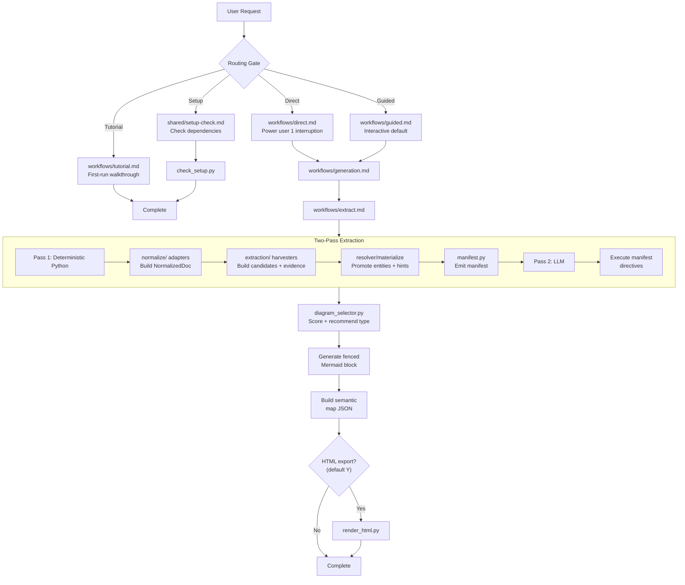

# legal-diagram

Generate legal Mermaid diagrams from any input, with an optional downloadable HTML figure.

## Part A: User Guide

Everything needed to set up and use the skill: what it does, setup, a quick start, the three lanes, HTML export, and troubleshooting.

### What It Does

`/legal-diagram` turns legal material into a diagram. Drop a contract, paste a matter description, or just describe a dispute, and it produces a timeline, an org chart, an obligation checklist, a decision tree, or one of several other diagram shapes. A Python engine reads the structure of your document, harvests legal candidates with evidence, promotes high-confidence entities, and hands compact unresolved evidence to Claude; Claude then fills the gaps and picks the diagram that fits. The diagram renders inline in any Mermaid-capable Markdown viewer (GitHub, VS Code, Obsidian, Claude in the browser), and can be exported as an HTML figure with a plain-language walkthrough.

### Prerequisites

- Python 3.9 or newer on your PATH.
- For binary formats (`.docx`, `.pdf`, `.xlsx`, `.pptx`) and HTML export: the packages in `requirements.txt`. Use `constraints.txt` for release-verification installs. Markdown, plain text, pasted text, and conversation context need only the Python standard library, so you can use the skill before installing anything.
- No special environment is required. HTML export defaults to a `./diagrams/` folder (created if absent), or any path you specify. No private workspace file is written.
- Semantic node colouring is pure JS/CSS in the HTML export — no new Python dependencies.

### Installation / Setup

1. Confirm Python: `python --version` (expect 3.9+).
2. Install the optional parsers and HTML renderer:
   ```bash
   pip install -r <skill-dir>/requirements.txt -c <skill-dir>/constraints.txt
   ```
3. Verify setup:
   ```bash
   python <skill-dir>/scripts/check_setup.py
   ```
   You should see JSON like `{"ok": true, "installed": [...], "missing": []}`. If `ok` is `false`, the `missing` list names the packages to install. Even with packages missing, Markdown and pasted-text input still work.

Inside Claude, you can also just say "check setup" to run this step.

### Quick Start

Drop a contract and ask for a picture:

> You: Diagram this dispute. [attach `vendor-dispute.md`]
>
> Skill: Want me to just make the diagram, or build it with you step by step?
>
> You: just make it
>
> Skill: Found 6 events, 3 obligations, 2 parties. I drew a **timeline** because six dated events drive a litigation chronology. This matter would also work as an **obligation checklist** or a **party map**. Want either?
> [fenced Mermaid timeline displayed inline — nodes coloured by semantic category, no note written]
> Export as standalone HTML? Y/N (default Y)

That is the whole loop: digest, pick the best diagram, explain why, offer HTML export, offer alternatives.

### Detailed Usage / Deep Dives

The skill picks one of three lanes from your phrasing. You never name a lane in jargon; it asks in plain language when unsure.

#### Guided lane (default)

The interactive path, best for casual users. It digests your input (or, with no document, asks a short set of questions tailored to the matter type: litigation, corporate, compliance, employment, IP, privacy, bankruptcy, tax, real estate), then walks you through two blocking gates before generating:

1. **Plain-language digest** — every populated field rendered in plain English (parties, events, obligations, claims, communications, risk items, legal authorities, and so on). You confirm, correct names, add missing items, or remove anything before proceeding.
2. **Type confirmation** — the selector recommends a diagram type with a rationale and lists alternatives; you confirm or switch before anything is drawn.

After generation, HTML export is always offered (default Y). One matter commonly yields several diagrams in a session. Trigger words: "step by step", "build it with me", or simply a request with no speed signal.

The HTML export includes a semantic colour layer: nodes are coloured by legal meaning using a muted legal palette (party nodes in slate blue, authority in sage, risk in dusty rose, outcomes in stone grey). Accessibility patterns (diagonal hatch for authority, cross-hatch for risk, dots for outcomes) provide a colorblind-safe secondary channel. A high-contrast toggle button (`◐`) in the diagram controls switches all fills to white with black borders and bold strokes. A colour legend is auto-generated below the diagram from the active palette.

#### Direct lane (power user)

The fast path. It reads every signal in one pass and generates with at most one interruption (it only stops to ask if extraction is empty, the file is missing, or the diagram-type confidence falls below 0.50). Trigger words: "just make it", "quick", an exact diagram name, or the `--direct` flag.

#### Tutorial lane (first run)

A guided walkthrough that detects your setup and runs one worked example end to end (a litigation chronology or a corporate ownership structure). Trigger words: "tutorial", "show me how", "first time", "demo".

#### Input formats

Markdown, plain text, `.docx`, `.pdf`, `.xlsx`, `.pptx`, pasted text, or the current conversation. Large PDFs are probed first and you are asked for a page range; scanned PDFs (no extractable text) prompt you to paste instead.

The extractor emits only the input basename in `input_source` by default. Full local paths are available only with `--include-source-path` for trusted internal workflows. Default resource caps protect public/shared use: 25 MB file size, 50 PDF pages, 5000 DOCX paragraphs, 200 DOCX tables, 5000 DOCX table rows, 200 PPTX slides, 5000 PPTX text shapes, 20 XLSX sheets, 1000 XLSX rows per sheet, and 50000 XLSX cells per sheet. Override these with the matching `--max-*` flags only for trusted local inputs.

#### Diagram names

You only ever see plain-language names: timeline, schedule, flowchart, decision tree, org chart, obligation checklist, who-does-what-when, mind map, priority grid, experience map. You can ask for any of these by name ("make me an org chart") and the skill maps it internally.

#### HTML export

After every diagram, the skill asks: "Export as standalone HTML? Y/N (default Y)." Pressing Enter or typing Y generates an HTML figure: the diagram plus a scientific-paper-style caption, an overview, a "how to read this" legend, key observations, and limitations, with a toolbar to download SVG, PNG, save the page, pan and zoom, and edit-and-re-render. The export escapes all matter text and runs Mermaid in strict mode. It embeds a vendored Mermaid file under `assets/vendor/` when that file is present; otherwise it shows the escaped Mermaid source unless you explicitly render with `--allow-cdn`, which loads pinned Mermaid 10.9.1 from jsDelivr. You can also pre-signal with `--html` to skip the prompt.

### Troubleshooting

| Problem                                                                    | Cause                                                        | Solution                                                                                                                     |
| -------------------------------------------------------------------------- | ------------------------------------------------------------ | ---------------------------------------------------------------------------------------------------------------------------- |
| `Parse error ... Expecting 'NEWLINE', got 'LINE'` in a requirement diagram | A hyphen in an `id:` value is lexed as a relationship token  | Use alphanumeric IDs (`PRIV001`, not `PRIV-001`). The skill applies this guard automatically; see `shared/parser-guards.md`. |
| `check_setup.py` reports `ok: false`                                       | `python-docx`, `PyMuPDF`, or `jinja2` not installed          | `pip install -r requirements.txt -c constraints.txt`. Markdown and pasted text still work without them.                      |
| HTML export shows Mermaid source instead of a rendered diagram             | No vendored Mermaid asset and CDN fallback was not enabled   | Add a vendored Mermaid file under `assets/vendor/`, or re-export with `--allow-cdn` if network loading is acceptable.                        |
| Diagram comes back empty from a PDF                                        | Scanned (image-only) PDF, no extractable text                | Paste the relevant text instead, or run OCR first.                                                                           |
| Skill stops to ask which diagram                                           | Selector confidence below 0.50 on thin or mixed-signal input | Give a clearer intent ("make a timeline") or add more detail to the matter.                                                  |
| Org chart renders broken with spaces in names                              | Mermaid node IDs reject spaces and hyphens                   | Handled automatically by entity normalization (`shared/parser-guards.md`); the original name stays in the label.             |

### Glossary

- **Candidate**: a typed extraction proposal with a target field, frame type, normalized value, evidence IDs, signals, anti-signals, and confidence.
- **EvidencePacket**: a compact snippet plus `SourceRef` that tells Claude exactly where support for a candidate came from.
- **PromotionDecision**: the resolver outcome for a candidate: `promote`, `hint`, or `suppress`, with a reason and final entity ID when promoted.
- **SourceRef**: source provenance for a candidate or evidence packet: source basename/stdin by default, block ID, heading path, table coordinates, page/slide/sheet, and character span where available. Full paths require `--include-source-path`.
- - **Enrichment directive**: an instruction in the manifest telling Claude exactly which field to fill and where to look.
- **ExtractionHint**: a flagged passage the resolver did not promote, handed to Claude with a confidence score.
- **ExtractionResult**: the typed ground-truth object holding all extracted entities.
- **Hard cap 1**: the direct lane's rule that it interrupts the user at most once.
- **Lane**: one of the three interaction modes (tutorial, guided, direct).
- **Manifest**: the JSON the extraction script emits: canonical entities, hints, coverage, compatibility directives, candidate diagnostics, and compact LLM handoff.
- **Mermaid**: a text-based diagram syntax that renders to a picture; the skill's output format.
- **NormalizedDoc**: the structure-preserving model (blocks, headings, tables) every input format is converted into.
- **Selector**: `diagram_selector.py`, which scores the extracted entities plus the intent and recommends a diagram type with a confidence value.
- **Two-pass extraction**: deterministic Python first (Pass 1), directive-driven Claude enrichment second (Pass 2).

## Part B: Technical Reference

Architecture, design rationale, file map, and maintenance notes for anyone modifying the skill.

### Architecture Overview



The Python engine is a five-layer pipeline. Layer 0 (`normalize/`) converts any format into a `NormalizedDoc` that preserves headings, lists, heading paths, and tables. Layer 1 (`extraction/`) harvests typed candidates with `EvidencePacket` provenance from prose and table rows. Layer 2 resolves candidates into `promote | hint | suppress`, materializes promoted candidates into the canonical `ExtractionResult`, and keeps unresolved candidates as compact LLM evidence. Layer 3 (`manifest.py` and `workflows/extract.md`) emits stable manifest keys plus candidate diagnostics and asks the LLM to return JSON Patch operations for unresolved evidence only. Layer 4 validates the enriched result and runs `diagram_selector.py`.

### Key Design Decisions

- **Standalone, Python, no external-skill dependencies.** Extraction is direct binary parsing (`python-docx`, `PyMuPDF`, `openpyxl`, `python-pptx`), not a handoff to a separate document tool. Python was chosen because document-format extraction is where Python's libraries dominate, and a single-language package is simpler to copy and run.
- **Candidate-first precision.** The deterministic layer now harvests broadly, but only resolver-approved candidates become canonical entities. Medium and low confidence candidates stay as hints with evidence packets, so the LLM can fill gaps without rereading the whole source or inventing unsupported entities.
- **Directive-driven enrichment.** The manifest hands Claude an explicit, bounded to-do list rather than asking it to "extract everything". Pass 2 is therefore predictable in what it touches and cheap to run.
- **Offline-graceful imports.** Every heavy import is lazy (inside the adapter that needs it), so Markdown and pasted-text paths run with zero third-party packages installed.
- **Plain-language user surface.** Mermaid type names never reach the user; a glossary in `shared/diagram-type-map.md` maps them to words like "org chart". Legal vocabulary is kept; only technical diagram vocabulary is hidden.
- **One generation core.** `direct` and `guided` differ only in elicitation; the select-guard-generate-deliver core lives once in `workflows/generation.md`.

### File Reference

| File                                  | Purpose                                                           | When loaded                         |
| ------------------------------------- | ----------------------------------------------------------------- | ----------------------------------- |
| `SKILL.md`                            | Routing gate, lane selection, plain-language rule                 | On trigger (entry point)            |
| `workflows/tutorial.md`               | First-run walkthrough + setup gate                                | Tutorial lane                       |
| `workflows/guided.md`                 | Interactive default lane                                          | Guided lane                         |
| `workflows/direct.md`                 | Power-user lane, hard cap 1                                       | Direct lane                         |
| `workflows/generation.md`             | Shared select → guard → generate → deliver core                   | Both lanes                          |
| `workflows/extract.md`                | Two-pass extraction sub-workflow                                  | Both lanes                          |
| `workflows/html-export.md`            | FigureDescription build + HTML write                              | On HTML request                     |
| `shared/setup-check.md`               | Session-cached dependency check                                   | First extraction                    |
| `shared/parser-guards.md`             | Per-type guards, entity normalization, confirmed bugs             | Before generation                   |
| `shared/figure-description-schema.md` | FigureDescription fields, captions, legends, risk rubric, caveats | HTML export, risk classification    |
| `shared/diagram-type-map.md`          | 30 categories → type, plus the plain-language glossary            | Type resolution                     |
| `shared/elicitation.md`               | No-docs intake question sets                                      | Guided, no-docs path                |
| `shared/node-styles.md`               | Semantic palette, field→category mapping, CSS class naming        | Generation Step 3.5, HTML export    |
| `references/extraction-schema.md`     | Field catalogue, detection tiers, signals                         | Pass 2 enrichment                   |
| `PORTABILITY.md`                      | Standalone classification and copy requirements                   | Maintenance                         |
| `scripts/check_setup.py`              | Dependency check → JSON                                           | Setup, every lane                   |
| `scripts/extract_entities.py`         | Orchestrator: normalize → extract → manifest JSON                 | Pass 1 (entry point)                |
| `scripts/normalize/`                  | 6 format adapters + `NormalizedDoc` model                         | Pass 1                              |
| `scripts/extraction/`                 | Candidate harvesters, resolver, materializer, and LLM handoff     | Pass 1                              |
| `scripts/extraction/manifest.py`                 | Coverage map, compatibility directives, and candidate diagnostics | Pass 1                              |
| `scripts/extraction/schema.py`        | All dataclasses (entities, hint, manifest types)                  | Imported by the engine              |
| `scripts/diagram_selector.py`         | Enriched extraction + intent → recommended type                   | After Pass 2                        |
| `scripts/render_html.py`              | Mermaid + FigureDescription → standalone HTML                     | HTML export                         |
| `assets/html_template.html`           | Jinja2 HTML shell with download toolbar                           | HTML export                         |
| `requirements.txt`                    | Python package compatibility requirements                         | Setup                               |
| `constraints.txt`                     | Pinned release-verification dependency set                        | Release verification                |
| `legal-diagram-readme.md`             | This guide and technical reference                                | Maintenance (not loaded at runtime) |

Extractor regression tests live at `scripts/tests/test_extraction.py` and can run standalone without pytest.

Release verification:

```bash
pip install -r requirements.txt -c constraints.txt
python scripts/check_setup.py
python scripts/tests/test_extraction.py
python -m pip_audit -r requirements.txt
```

### Maintenance Notes

- **Script CLIs are contracts.** `extract_entities.py` emits the manifest the skill workflows parse, with `candidate_manifest` and `llm_enrichment`; `diagram_selector.py` returns `{recommended_type, rationale, alternatives, confidence}`; `render_html.py` returns `{ok, output_path, file_size_kb}`. Changing these shapes means updating `workflows/extract.md` and `workflows/generation.md` in lockstep.
- **Pass 1 must stay deterministic.** No `Date.now()`, `random`, or wall-clock in the scripts; results are sorted by anchor so tests are reproducible.
- **Extractor contract.** Add new extraction logic as candidate harvesters, not direct entity writers. Promotion thresholds and materialization rules are the deterministic extraction contract; candidate diagnostics must stay richer than canonical `extraction_result`.
- **All Mermaid-safety rules live in `shared/parser-guards.md`** (guards, entity normalization, confirmed parser bugs). The two former files `legal-diagram-quirks.md` and `entity-normalization.md` were merged here; do not recreate them.
- **PORTABILITY.md uses a fixed section structure** expected by the source repository's skill validator; keep its headers intact when editing.
- **README location is intentional.** This file sits in the skill folder, named `legal-diagram-readme.md` rather than `README.md` (the source repository's skill validator disallows a literal `README.md` in a skill root).

## Part C: Next Steps

Roadmap and known gaps for future development of the skill.

- **PDF table extraction** is the weakest input path (font-heuristic headings, no column detection). A `pdfplumber`-based table adapter would lift `tasks`/`conditions`/`claim_classes` recovery from PDFs.
- **Party alias extraction** now promotes defined-party and table-row parties; freeform party mentions without definition or repeated role evidence still drop to hints. A light NER pass could raise recall.
